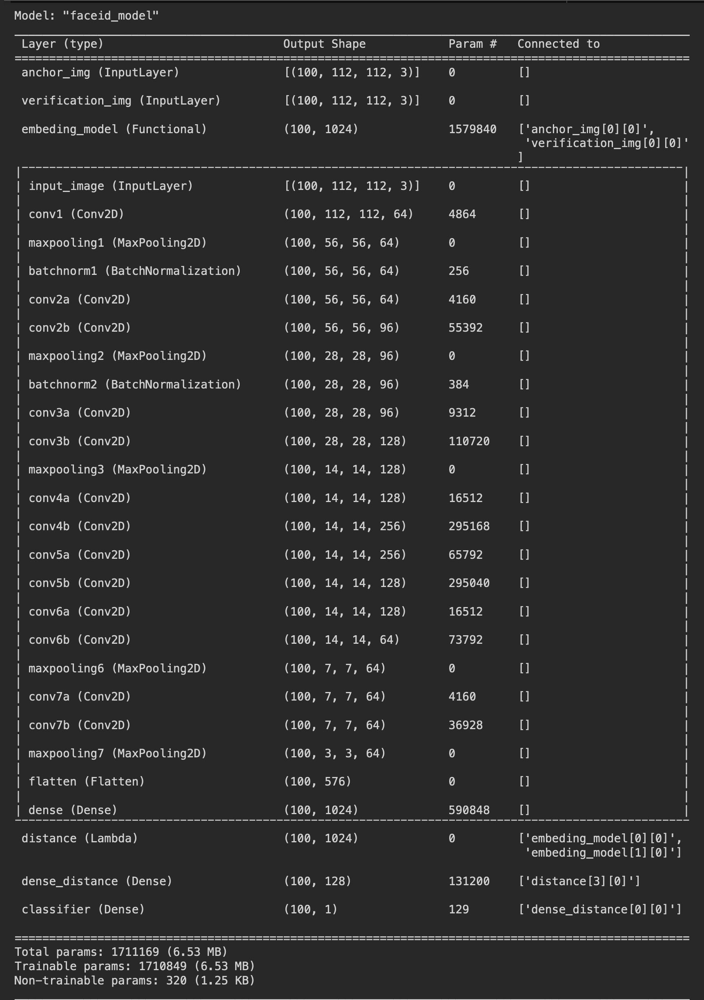
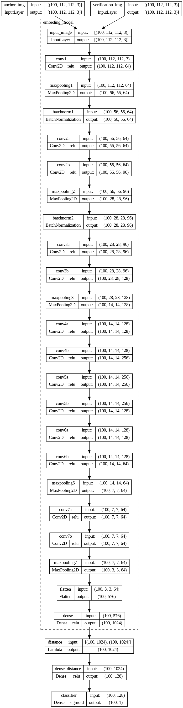

# Siamese Model for DeepFace Verification(similar to [FaceNet architecture](https://arxiv.org/abs/1503.03832)) with TensorFlow Serving

## Overview

This repository contains a Siamese model for deepface verification wich simillar FaceNet model, dockerized with TensorFlow Serving. The Siamese architecture is commonly used for face verification tasks, and this implementation is designed to provide an efficient and accurate solution.

## Model Architecture

### Input Convolutional Network

The model starts with a shared input convolutional network (embeding_model), featuring:

- Convolutional layers for hierarchical feature extraction.
- Max pooling layers for spatial down-sampling.
- Batch normalization for stable activations.

### Siamese Model Construction

The Siamese model consists of:

- Anchor and verification image inputs for comparison.
- An embedding model, reusing the input convolutional network to generate embeddings.
- A distance layer computing the absolute difference between embeddings.
- A dense layer reducing the dimensionality of the computed distance.
- A final dense layer with sigmoid activation for similarity probability.

### Full Architecture

#### Summary


#### Plot


## Dataset

We use [DigiFace-1M Dataset](https://github.com/microsoft/DigiFace1M) for training our Model, its not the best a cause low quality images shape (112, 112, 3), but the we sufficed for it.
its recommended to use other dataset like [LFW](http://vis-www.cs.umass.edu/lfw).
Modify [train/dataset.py](train/dataset.py) file to load images and label it [ label=((anchor_images, verification_images), labels) ] as two labels (label_train, label_test)
For custom datset, edit `.env` file DATASET_PATH varible to your train dataset

## Training/Evaluating Process Steps

**All Steps in [train/faceid.py file](train/faceid.py)**

**1. Load Dataset**

python
```
((X_a_train, X_v_train), y_train), ((X_a_test, X_v_test), y_test) = load_dataset()
```

The dataset is loaded using the load_dataset function, resulting in training and testing data for both audio (X_a_train, X_a_test) and visual inputs (X_v_train, X_v_test), along with corresponding labels (y_train, y_test).

**2. Load Model**

python
```
model = make_model()
```

The CNN model is created using the make_model function.

**3. Compile Model**

python
```
model.compile(optimizer='adam', loss='binary_crossentropy', metrics=['accuracy'])
```

The model is compiled using the Adam optimizer and binary cross-entropy as the loss function. Accuracy is chosen as the metric for evaluation.

**4. Train Model**

python
```
model.fit(x=[X_a_train, X_v_train], y=y_train, batch_size=BATCH_SIZE, epochs=EPOCHS)
```

The model is trained on the training data (X_a_train, X_v_train, y_train) for a specified number of epochs and with a specified batch size.

**5. Evaluate Model**

python
```
model.evaluate(x=[X_a_test, X_v_test], y=y_test, batch_size=BATCH_SIZE)
```

After training, the model is evaluated on the testing data (X_a_test, X_v_test, y_test) using the evaluate function.

**6. Freeze Model Layers**

python
```
for layer in model.layers:
    layer.trainable = False
```

All layers of the trained model are frozen to prevent further training.

**7. Save Model**

python
```
model.save('saved_model.pb')
```

The frozen model is saved as 'saved_model.pb' for future use.

Make sure to modify `.env` file for MODEL_NAME, MODEL_VERSION, SAVED_MODEL_PATH, and [train/envs.py](train/envs.py) file for set BATCH_SIZE, EPOCHS, .... varibles

bash
```
docker compose -f docker-compose.train.yml up --build
```

### Train the model on google colab cloud

link to [google colab notebook](https://colab.research.google.com/drive/1f-Eu5u8uThs7q2u4mvG-QOHO7mTdSSns?usp=sharing).

Notes to Consider:

    - use T4 GPU runtime for fast training
    - use other dataset instead default one
    - download the saved model for prediction use on deployment/production

## Making Predictions with TensorFlow Serving

To make predictions using the Siamese model served with TensorFlow Serving, you can send HTTP POST requests to the TensorFlow Serving API endpoint. Follow the steps below:

**First: Run the container**

bash
```
docker compose up --build
```

our model listen to two ports: Port 8500 exposed for gRPC, and Port 8501 exposed for the REST API

**Finally: Send requests to the TensorFlow Serving API.**

use request-tester.py script to test our model (make sure to moify model name), input images should be (112, 112, 3) shape

bash
```
python3 request-tester.py path_to_image1 path_to_image2
```

on successful the response contain: {"predictions": [[<float_number_between_0_and_1>]]}

on failure the response contain: {"error": "<error_description>"}

# Resourses
[FaceNet paper](https://arxiv.org/abs/1503.03832)

# Conclusion

In this repository, we've presented a Siamese model for deepface verification, along with instructions on training, evaluation, and deployment using TensorFlow Serving. The model is designed to provide accurate and efficient results in face verification tasks.

## Key Highlights

- **Siamese Model Architecture:** The model employs a Siamese architecture with a shared input convolutional network, allowing it to compare the similarity between two face images effectively.

- **Training and Evaluation:** Detailed instructions are provided on how to train the model and evaluate its performance. These steps are crucial for achieving optimal results on your specific dataset.

- **TensorFlow Serving Deployment:** The model can be easily deployed using TensorFlow Serving and Docker. The provided instructions in the README guide you through the Dockerization process, making it straightforward to serve the model in production environments.

## Next Steps

- **Contributions:** We welcome contributions from the community. Feel free to submit issues, propose new features, or contribute code to enhance the functionality and performance of the Siamese model.

- **Customization:** Tailor the model to your specific needs by adjusting hyperparameters, experimenting with different architectures, or incorporating additional features into the training pipeline.

- **Acknowledgments:** We appreciate your interest and engagement with this project. Special thanks to all contributors who help improve and evolve this deepface verification solution.

Feel free to explore the provided resources, experiment with the model, and contribute to its ongoing development. If you have any questions or suggestions, don't hesitate to reach out to the project maintainers.

